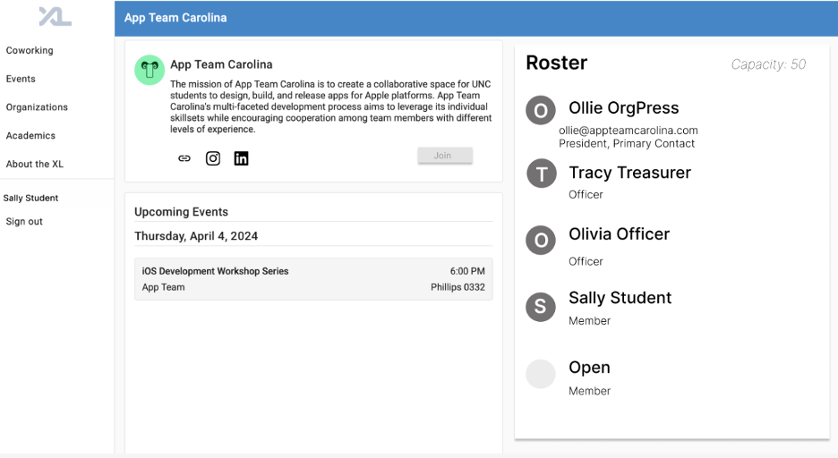
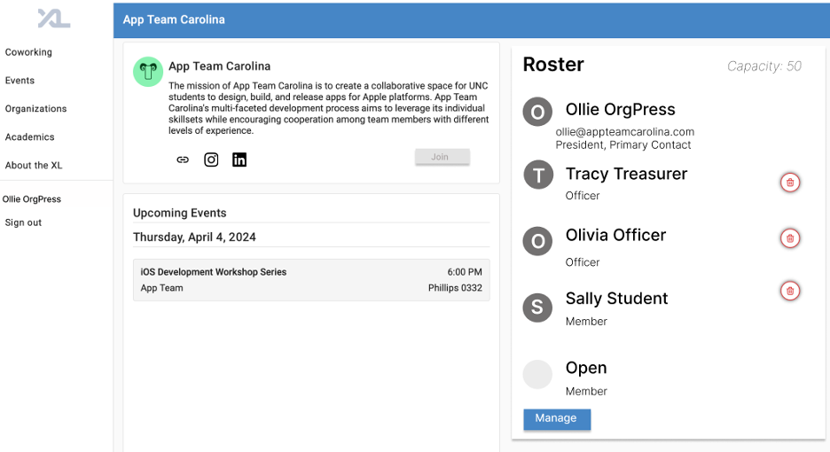
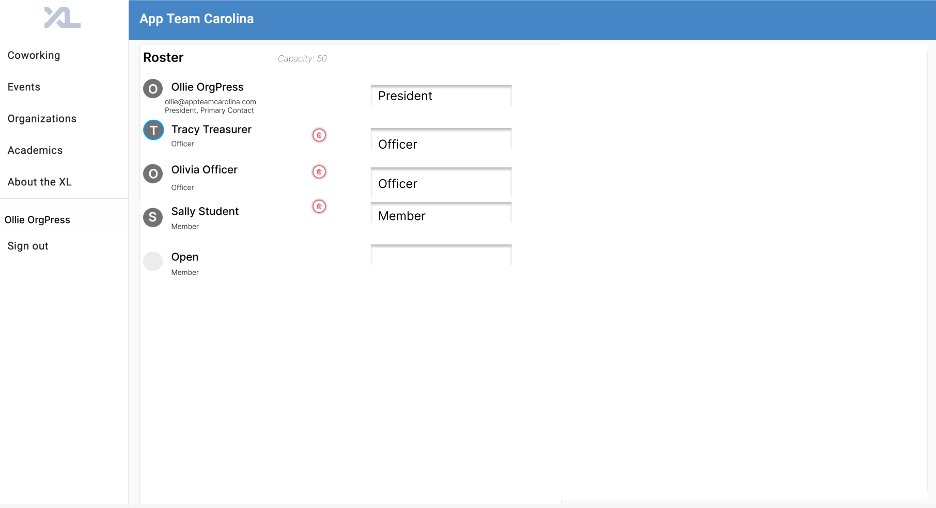

**Improved Organization Tab Team E1 🔥**

[Brian Britt](https://github.com/bmbritt), [Norah Binny](https://github.com/nbbinny), [Evan Menendez](https://github.com/ejaym), [Chasity Davis](https://github.com/chasityhdavis)

**Overview:**

The organization feature, as it is now, is relatively barebones in terms of actual functionality–serving more as a directory than anything else. It would be helpful to all users if there was a way to view the members of an organization, as well as leadership roles. This implementation would increase the tab’s functionality which would not only improve the health of the website in regards to joining organizations, but also provide a way for admins to view the health of specific organizations in general.

**Key Personas:**

1. **Sally Student** can view which organizations are open, request-based, and closed. Additionally, she can view the number of members in an organization, the open seats, and an organization’s capacity (if it exists). She can view the organization’s primary contact and get their contact information directly from the organization’s page. She can request to join an organization. She can see what level “member” she is in an organization, as well as the organizations she belongs to. She can also see and register for upcoming events.
1. **Olivia Officer** can view all members of the organization and can manage the acceptance or denial of general members, as well as the removal of general members.
1. **Ollie OrgPres** can view all members of the organization and can manage the acceptance or denial of general members, the removal of general members, the promotion or demotion of organization officers, and the removal of organization officers. Additionally, he can manage the organization’s events and information.
1. **Rhonda Root** can view all members of the organization and manage the acceptance or denial of general members, the removal of general members, the promotion or demotion of organization officers, and the removal of organization officers. Additionally, she can manage features on the organization’s page.
- In managing all organization rosters and events…
  - Memberships to be based on Academic Terms (e.g. joining for Fall 2024 and Spring 2025)
  - Memberships to have an admin toggle which give a member privileges to edit CSXL website info/events for organization
  - The ability for an org to list its leaders (and members?) by academic term on their organization page
  - **User Stories:**

As **Sally Student**, I want to see which organizations are open and request-based, so that I know if I have to apply in order to join.

As **Sally Student**, I want to see the organization’s primary contact, so I know who to reach out to for information regarding the organization.

As **Sally Student**, I want to see how many members are in the organization, the roster’s capacity, and how many slots are open.

As **Olivia Officer**, I want to manage the roster of general members for my organization–including the approval or rejection of join requests, and the removal of members.

As **Ollie OrgPres**, I want to manage the roster of organization officers and general members for my organization–including the promotion and demotion of organization officers, and removal of any members (both general or officers).

As **Rhonda Root**, I want to see a list of all organization members, organized by title (organization president, officer, member, etc.). Additionally, I want to be able to manage every member and assign/edit roles within the roster. I also want to have the ability to delete/edit any organization.

**Wireframes:**

1. Wireframes / Mockups: Include rough wireframes of your feature’s user interfaces for the most critical user stories, along with brief descriptions of what is going on. These can be hand-drawn, made in PowerPoint/KeyNote, or created with a tool like [Figma](https://www.figma.com/). *To see an example of a detailed wireframe Kris made this summer before building the drop-in feature, see this [Figma board](https://www.figma.com/file/UFyoGbahicMYHErfAMmWXR/XL-Coworking-Application?type=design&node-id=0%3A1&mode=design&t=2QCW04OFXpHIbvng-1). You will notice the final implementation is not 1:1 with the original wireframe!*

*Sally Student* 

*Sally Student is a member of App Team Carolina and can see the members of the organization, the roster’s capacity, and how many slots are open.*

*Sally Student can see which organizations are open and request-based, so they know if they need to apply to join. Since Sally Student is already a member they cannot join again.*

*Sally Student can see who the primary contact for the organization is so they can reach out to them.*

*Ollie OrgPress*

*Ollie OrgPress is allowed to manage the roster including the promotion and demotion of organization officers, and the removal of any members.* 

*Clicking on the manage button will route the president user to a different page where they will be able to manage their roster.*

**Technical Implementation Opportunities and Planning:**

Existing Codebase

- Dependencies
  - Users: When joining an organization, the user should be associated with the organization and vice-versa so that the user can see what organizations they are a part of and so that organization can display who is in it.
  - Roles: Functionality will differ between roles. Ambassadors should have the same privileges as a student when it comes to organizations, only a root administrator should have the ability to edit/delete organizations.
    - We also will depend on the permissions functions already in the CSXL website to do this.
  - Organization: We will work off the existing organization component in order to add additional functionality such as adding a president user, displaying the members in the organization, ect.
- Extensions
  - A new column will need to be added to the Users database which stores which organization(s) they are a part of.
  - New columns will need to be added to the Organizations database named President, Officers, and Members, as well as a column which states if the organization is open, closed or based on request.
    - The data within these columns will point to a specific user entity. Or could be set to null if presidents, officers, or members do not exist.
    - The column which states if it is open, closed, or based on request should always be required.
- Page Components and Widgets
  - Organization Component: The amount of slots open in a club should also be visible on this screen in addition to the members and leadership members. The open/closed/based on request should be displayed here as well. If the user is an officer/president, they should be able to remove members, and approve or deny requests to join the group. The president should be able to promote/demote members of the group.
  - User Component: The frontend UI for the user profile will need to be edited with the organizations that user is a part of on the right side of their profile information.
  - Request to Join Component: Form for non-members of an organization to apply or request admission to an organization.
  - Root User Edit Organization Component: Root admin’s own organization tab that allows them to access all organizations and delete/edit any component of an organization (including the organization itself).
  - Organization Widget: Cards for each organization should be edited so that they display the open/closed/based on request status of the organization. Should also include buttons if the user is an officer/president to approve/deny requests to join and the president’s ability to promote/demote members. 
  - User Widget: A separate table in the User Component that displays which organizations the user is a part of.
  - Request to Join Widget: A form displayed to non-members when they click the button to request admission to an organization.
  - Root User Edit Organization Component Widget: Much like the normal organization widget, but with the added ability to edit/delete any aspect of the organization.
- Models
  - Members: Model used to store all information about a member of an organization(name, position).
  - Roster: Model used to store all information about a roster(member, capacity, primary contact).
  - Requests: Model used to store all information associated with requesting to join a club (Name, year, major).

- API / Routes
  - Get Members(/user/organizations/{organization.id}/roster): API endpoint for retrieving all members of an organization 
  - Get Organizations (/user/organizations): API endpoint for retrieving all organizations in which a user is a member
  - Get Request(/user/organizations/{organization.id}/roster): API endpoint for retrieving all requests to join organization
  - Post Request(/user/organizations/{organization.id}/roster): 
  - Post Member (/user/organizations/{organization.id}/roster): API endpoint for adding a member to an organizational roster
  - Put Member (/user/organizations/{organization.id}/roster): API endpoint for updating a user’s role in an organizational roster
  - Delete Member (/user/organizations/{organization.id}/roster): API endpoint for removing a member from an organizational roster
- Security and Privacy concerns
  - Only members of a request-based organization should be able to see the member roster of an organization
    - Officers and organization presidents should always be visible
  - Only organization officers, organization presidents, and Ronda Root should be able to modify organization membership settings, rosters, and events
    - Only these roles should be able to approve or deny requests to join an organization
  - Officers should not be able to modify the membership status of other officers or an organization’s president

