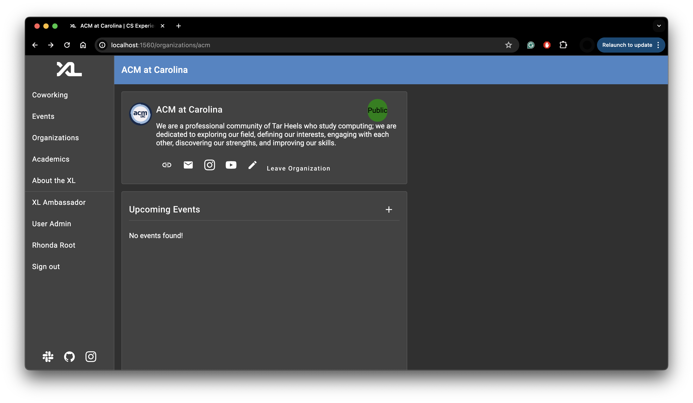
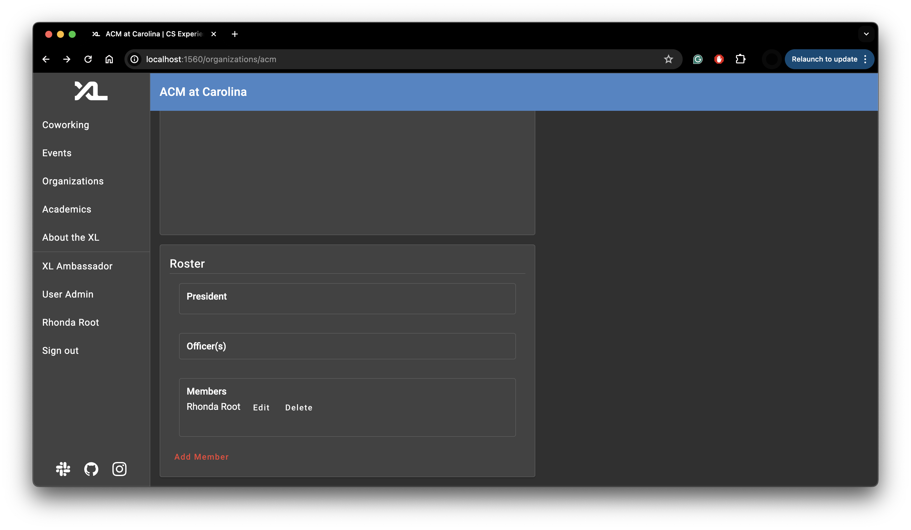
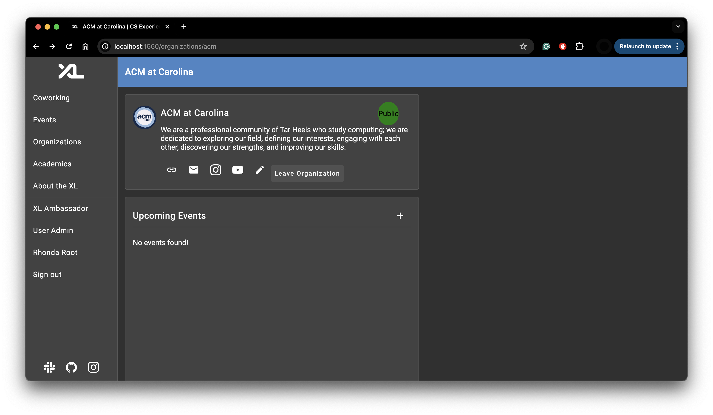
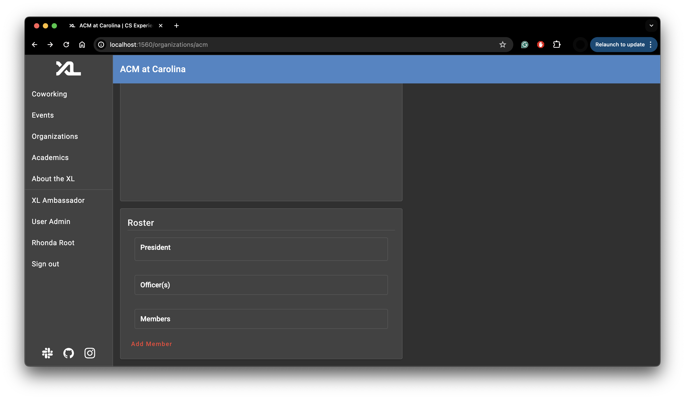
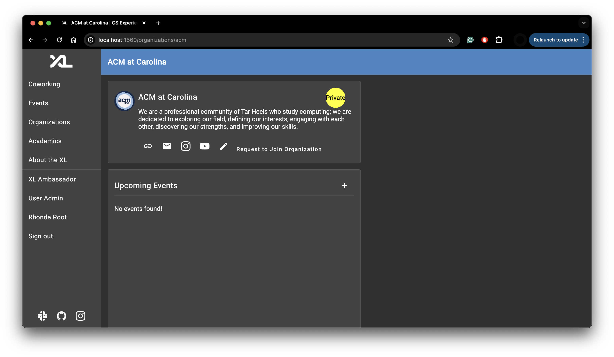
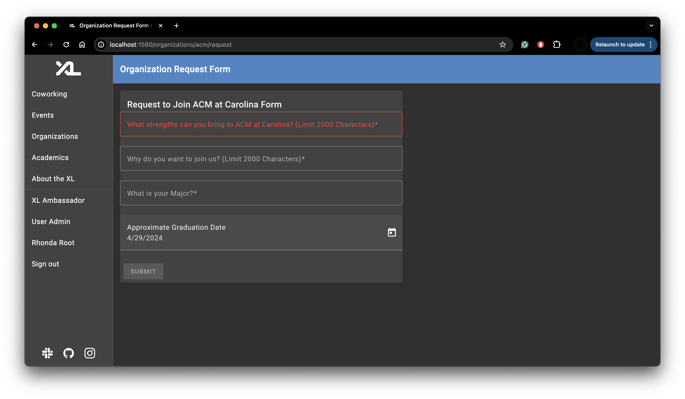
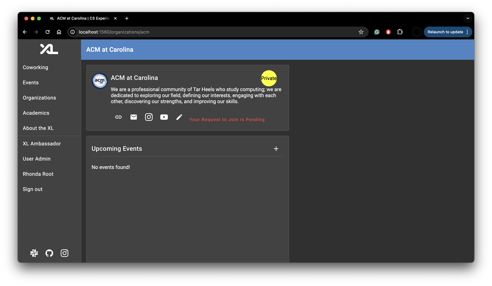

# Technical Specification Documentation

## Authors: [Evan Menendez](https://github.com/ejaym), [Norah Binny](https://github.com/nbbinny), [Brian Britt](https://github.com/bmbritt), [Chasity Davis](https://github.com/chasityhdavis)

## Story 1: Add/Delete Self to Public Organization 

### Models:
We created both a frontend and backend model for the Member class. The member class has six fields: 

	id: int | none, name: str, profile_id: int, role: str, title: str | none, and organization_id: int. 
- A member’s “id” is unique and differs amongst each organization they belong to. 
- A member’s “name” is taken from their profile. 
- A member’s “profile_id” refers to their PID. 
- A member’s “role” refers to their role in the organization (i.e., President, Vice President, Organization Officer, etc.)
- A member's "title" refers to the special title they may hold in the organization, and defaults to an empty string.
- A member’s “organization_id” refers to the unique id of the organization they belong to.

### API Routes:

	GET  ("/organization/{slug}"): This API route gets all the members in the specific organization based on the slug provided 
 
 	GET ("/organization/{id}"): This API route gets a specific member based on the ID provided
  
	POST ("/organization/{slug}"): This API route creates a new member in the specific organization
 
 	PUT ("/organization"): This API route updates a member based on a new member object created, which is passed in as a parameter
  
	DELETE ("/organization/{slug}"): This API route deletes yourself from a specific organization
 
 	DELETE ("/delete/{memberID}"): This API route deletes a specific member from an organization

## Database/ Entity-Level Representations Decisions: 
 
### Member Entity: 	

The Member Entity’s table name is “member”

 	Member has six fields: id: Mapped[int], name: Mapped[str], role: Mapped[str], title: Mapped[str], profile_id: Mapped[int], organization_id: Mapped[int], organization: Mapped[“OrganizationEntity”].
The Member Entity has two methods: from_model and to_model.
	- From_model converts the Member pydantic model into a Member Entity.
	- To_model converts a Member Entity into a Member pydantic model.
	
## Design Choice and Justification:

### Technical: 

We chose to implement a Member Entity instead of working with the preexisting User Entity because we wanted each member to have an organization ID associated with them (to uniquely identify each organization they belong to), as well as roles to define their position within the organization (i.e., President, Organization Officer, Member). 
 
### User Experience: 

We chose to publicly display an organization’s affiliations on their roster instead of keeping the information private because it allows potential members to reach out to the organization’s leaders with questions/concerns. It also allows potential members to see if their friends are a part of any specific organization at a glimpse.

*Rhonda Root wants to join ACM at Carolina! She guides her mouse over to the join organization button!*
#

*Rhonda clicked the button and it has magically changed to leave the organization button!*
#

*Rhonda now sees that she has been added as an official member of the organization! Hurrah!*
#

*Rhonda has had a change of heart and actually thinks that Women in Stem would be a better organization for her, she decides to leave the organization. She clicks the button and sees it change back into join organization.*
#

*Rhonda now sees that she has been removed from the roster, sad to see you go Rhonda!*

## Developer Guide:

To get started on our feature, you need to familiarize yourself with both the frontend and backend Member model and service, as well as the Member API and Member Entity.
The member model has five fields: id: int | none, name: str, profile_id: int, role: str, title: str, and organization_id: int.

The frontend Member service is located within the Organization service. It provides methods to get, add, edit, and remove members from a public/private organization in the front end.
The backend Member service provides the methods to add, edit, and remove members from a public/private organization in the database.

The Member API allows you to request, post, put (edit), and delete Member data.
The Member Entity contains the “member” table which stores all of the members’ information within the database (i.e., id, name, role, title, profile id, organization id, and associated organization)

## Story 2: Request to Join a Private Organization

### Models:

We created both a frontend and backend model for the CompletedRequestObject class (which will now be referred to as CROC). 

	The CROC has seven fields: id: int | none, name: str, organization_id: int, strength: str, reasoning: str, major: str, and profile_id: int.
- A request’s “id” is unique and differs amongst each organization it belongs to. 
- A request’s “name” is taken from the user’s name submission.
- A request’s “organization_id” refers to the unique id of the organization the request belongs to. 
- A request’s “strength” refers to the user’s inputted strengths (on the join request form).
- A request’s “reasoning” refers to the user’s inputted reason for wanting to join the organization (on the join request form).
- A request’s “major” refers to the user’s inputted major (on the join request form).
- A request’s “profile_id” refers to the user’s PID. 

#

We edited the front and backend models of an organization to include an additional property: closed: bool.

An organization's "closed" property determines if a user can join or request to join an organization, false means open (users can join/request to join), and true means it is closed (users cannot join or request to join).  

### API Routes:

	POST("/organization/{slug}"): This API route creates a new Request in the database.
 	

## Database/ Entity-Level Representations Decisions:
### Request Entity:

The Request Entity’s table name is “request”

	Request has eight fields: id: Mapped[int], name: Mapped[str], strength: Mapped[str], reasoning: Mapped[str], major: Mapped[str], profile_id: Mapped[int], organization_id: Mapped[int], organization: Mapped[“OrganizationEntity”]
The Request Entity has two methods: from_model and to_model.
From_model converts the Request pydantic model into a Request Entity.
To_model converts a Request Entity into a Request pydantic model.

 ### Organization Entity:

The Organization Entity's table name is "organization"

   	Organization has 18 fields: id: Mapped[int], name: Mapped[str], shorthand: Mapped[str], 
    
    slug: Mapped[str], logo: Mapped[str], short_description: Mapped[str], long_description: Mapped[str], website: Mapped[str], 
    
    email: Mapped[str], instagram: Mapped[str], linked_in: Mapped[str], youtube: Mapped[str], heel_life: Mapped[str],
    
    public: Mapped[bool], closed: Mapped[bool], events: Mapped[list["EventEntity"]],
    
    members: Mapped[list["MemberEntity"]], request: Mapped[list["RequestEntity"]]
    
The Organization Entity has two methods: to_model and from_model.
To_model converts an Organization Entity into an Organization pydantic model.
From_model converts the Organization pydantic model into an Organization Entity.

    
## Design Choice and Justification: 
### Technical: 

On the request form, we chose to include questions pertaining to the user’s strengths, as well as their motivation for requesting to join the organization. We opted for this over solely close-ended questions because it allows the organization’s leaders to determine if the user is a good fit for the organization.
### User Experience: 

After a user has submitted a request to join an organization, we decided to make the “Request to Join Organization button” turn red and display the text “Your Request to Join is Pending.” We opted for this over keeping the previous button because it allows the user to see the status of their request, as well as prevents them from submitting the form again (while approval is pending).

*Rhonda Root wants to join ACM at Carolina, however, it is a private organization! She guides her mouse over to the request to join organization button!*
#

*Rhonda clicked the button and it has now taken her to a new page that contains a form she must fill out to apply!*
#

*Rhonda filled out the form and hit submit, she has now been set back to the organization page, where she can see her request to join is now pending! Good Luck Rhonda!*

### Developer Guide:

To get started on our feature, you need to familiarize yourself with both the frontend and backend Request model and service, as well as the Request API and Request Entity. 
The request model has seven fields: id: int | none, name: str, organization_id: int, strength: str, reasoning: str, major: str, and profile_id: int.

The frontend and backend Request service(s) provide a method to add requests and store them in the database.

The Request API allows you to post the Request data.
The Request Entity contains the “request” table which stores all of the request information within the database (i.e., id, name, strength, reasoning, major, profile id, organization id, and organization)
